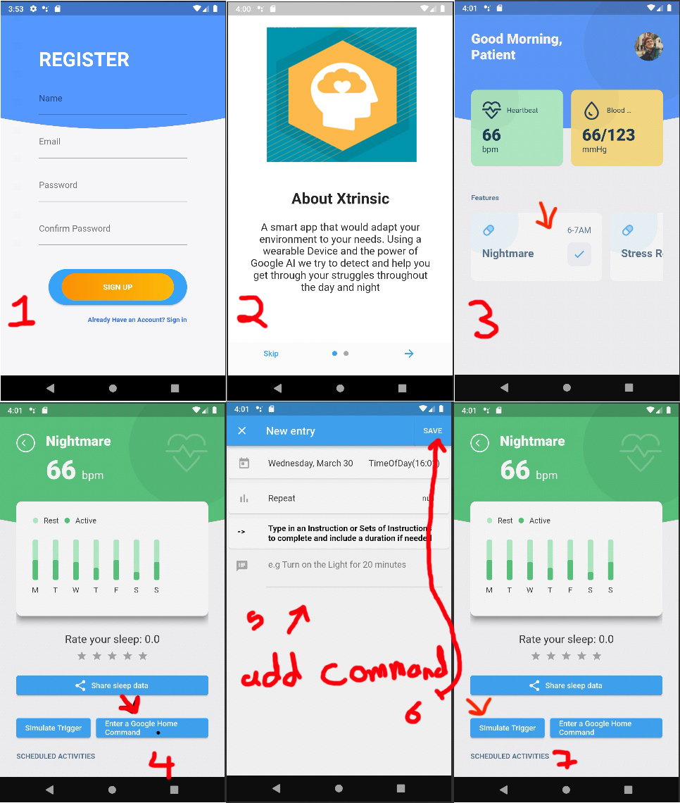

# About App

A smart app that would adapt your environment to your needs. Using (IoT),a wearable Device and the power of TensorFlow we try to detect and help you get through your struggles throughout the day and night
https://youtu.be/KYFi36nTe0g

## MVP Components and features checklist:
### on The Watch Side:
- [x]  finding a WearOS3 Device with the right sensors for data gathering (using Galaxy SmartWatch4)
- [x] Syncing Data between watch and phone, done using Google Health API (no need for extra WearableApp).
- [ ] Synch data directly with the Phone via bluetooth.
### On The Phone Side:
- [x] Phone App with Graphs, Buttons and placeholders to present our Idea.
- [x] Phone UI, done using Flutter.
- [x] Backend for a button to send a text command to google Assisstant
- [x] Smart devices management: managed by Google home and triggered by google assisstant.
- [x] trigger simulator button: a button that would simulate how the app would function after all the features are implemented (for presenting and debugging )
- [x] develope algorithms for mental health and behavior therapy (long sitting sessions, Stress detection, Nightmare detection)
### TODO (With Google Mentorship)
- [ ] integrate the developed algorithms in the app
- [ ] convert the TensorFlow model to TensorFlow light
- [ ] add firebase database for storing data
- [ ] fetch the data on the PHone from the Google Health API 

## Using the Mobile Application

The Sign Up and Log in function does not work yet, so just click **Sign Up** to begin to use the application as it takes you directly to the onboarding screen explaining the aim of the app with how to use it.

Then next to the Home Screen, the first card under **Features** named **Nightmare** is clickable to show the main idea of the application.

On this Page,

### Implemented Buttons/Features

The rate your sleep button works with the idea of allowing the user rate last nights sleep. Click the **Enter a Google Home command button** to enter a command and then click save to go back. Now you can click the **simulate trigger** to simulate the trigger of sending a command to Googl Assistant (this will be done by the watch for the main implementation).

Fig.1 - L-R A pathway from the Registration screen to the Detail Page that covers the usage of the application.

